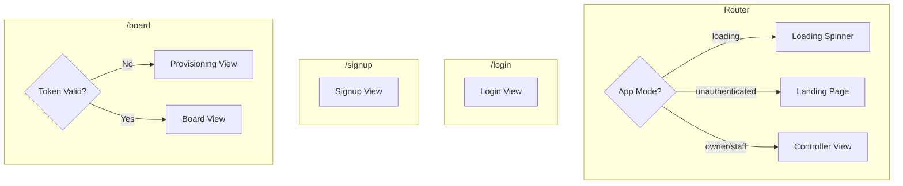

# HorseBoard UI State Tree

Complete map of all UI states, views, modals, drawers, and controls.

## Route Structure



---

## 1. Landing Page (`/`)

**Route**: `/` when `appMode === 'unauthenticated'`  
**File**: [Landing.tsx](file:///home/a/dev/horseboard/src/client/views/Landing.tsx)

```
Landing
├── Header (HorseBoard branding)
├── Pair Code Input
│   ├── [INPUT] 6-digit code field
│   ├── [BUTTON] Connect (disabled until 6 digits)
│   └── [ERROR] Connection error message (conditional)
├── Divider ("or")
└── Secondary Links
    ├── [LINK] "I'm the owner / manager" → /signup
    └── [LINK] "Sign in" → /login
```

**State Controls**:
| Control | Type | Effect |
|---------|------|--------|
| `pairCode` | signal | Stores 6-digit input |
| `isConnecting` | signal | Shows "Connecting..." on button |
| `connectError` | signal | Displays error message |

---

## 2. Login View (`/login`)

**File**: [LoginView.tsx](file:///home/a/dev/horseboard/src/client/views/LoginView.tsx)

```
LoginView
├── Header (Welcome Back)
├── Form
│   ├── [INPUT] Email
│   ├── [INPUT] Password
│   ├── [ERROR] Auth error (conditional)
│   └── [BUTTON] Sign In
└── Footer
    └── [LINK] Sign Up → /signup
```

**State Controls**:
| Control | Type | Effect |
|---------|------|--------|
| `email` | signal | Form field |
| `password` | signal | Form field |
| `error` | signal | Error display |
| `isLoading` | signal | Button disabled + "Signing In..." |

---

## 3. Signup View (`/signup`)

**File**: [SignupView.tsx](file:///home/a/dev/horseboard/src/client/views/SignupView.tsx)

```
SignupView
├── Header (Create Account)
├── Form
│   ├── [INPUT] Full Name
│   ├── [INPUT] Email
│   ├── [INPUT] Password
│   ├── [ERROR] Auth error (conditional)
│   └── [BUTTON] Sign Up
└── Footer
    └── [LINK] Log In → /login
```

**State Controls**:
| Control | Type | Effect |
|---------|------|--------|
| `name` | signal | Form field |
| `email` | signal | Form field |
| `password` | signal | Form field |
| `error` | signal | Error display |
| `isLoading` | signal | Button disabled + "Creating Account..." |

---

## 4. Board View (`/board`)

### 4a. Provisioning View (Unlinked Display)

**Condition**: `appMode === 'unauthenticated' || isTokenInvalid`  
**File**: [ProvisioningView.tsx](file:///home/a/dev/horseboard/src/client/views/ProvisioningView.tsx)

```
ProvisioningView
├── Title ("Connect Display")
├── Provisioning Code (6 characters displayed)
└── Instructions (3-step guide)
```

**State Controls**:
| Control | Type | Effect |
|---------|------|--------|
| `provisioningCode` | useSignal | Random code, polled for pairing |

### 4b. Linked Board View

**Condition**: Valid token, linked to a board  
**File**: [Board.tsx](file:///home/a/dev/horseboard/src/client/views/Board.tsx)

```
Board
├── Header
│   ├── Pair Code Badge (if set)
│   ├── Page Badge ("Page X / Y")
│   └── Time Mode Badge (AM/PM/AUTO)
├── Content
│   ├── SwimLaneGrid (horse/feed matrix)
│   └── Breadcrumb ("↓ N more feeds below") — conditional
└── Empty State (if no data)
    ├── Welcome Title
    ├── Instructions
    └── Pair Code (if set)
```

**State Dependencies** (read from stores):
| Store | Effect |
|-------|--------|
| `orientation` | horse-major / feed-major layout |
| `current_page` | Active page |
| `pageSize`, `rowPageSize` | Pagination |
| `effective_time_mode` | AM / PM / AUTO → AM/PM |
| `zoom_level` | Grid cell sizing |

**Board Theme**: `data-theme` attribute set to time mode (controls day/night styling)

---

## 5. Controller View (`/controller`)

**Condition**: `appMode !== 'unauthenticated'`  
**File**: [ControllerView.tsx](file:///home/a/dev/horseboard/src/client/views/ControllerView.tsx)

```
ControllerView
├── Content Area
│   ├── [TAB] HorsesTab (default)
│   ├── [TAB] FeedsTab
│   ├── [TAB] BoardTab
│   └── [TAB] SettingsTab
│
├── [DETAIL VIEW] HorseDetail (replaces tabs when horse selected)
│
└── Tab Navigation (bottom bar)
    ├── [BUTTON] Horses Tab
    ├── [BUTTON] Feeds Tab
    ├── [BUTTON] Board Tab
    └── [BUTTON] Settings Tab
```

**State Controls**:
| Control | Type | Effect |
|---------|------|--------|
| `activeTab` | signal | 'horses' \| 'feeds' \| 'board' \| 'settings' |
| `selectedHorseId` | signal | When set, shows HorseDetail instead of tabs |

---

### 5.1 Horses Tab

**File**: [HorsesTab.tsx](file:///home/a/dev/horseboard/src/client/views/Controller/HorsesTab.tsx)

```
HorsesTab
├── Header
│   ├── Title ("Horses")
│   └── [BUTTON] + Add Horse (if canEdit)
├── Search
│   └── [INPUT] Search horses
├── List
│   ├── HorseCard[] (filtered)
│   └── Empty State (conditional)
│
└── [MODAL] Add Horse Modal
    ├── [INPUT] Name
    ├── [INPUT] Note (optional)
    └── Actions
        ├── [BUTTON] Cancel
        └── [BUTTON] Add Horse
```

**State Controls**:
| Control | Type | Effect |
|---------|------|--------|
| `searchQuery` | signal (store) | Filters horse list |
| `isAddingHorse` | signal | Opens Add Horse modal |
| `newHorseName` | signal | Modal form field |
| `newHorseNote` | signal | Modal form field |

---

### 5.2 Horse Detail View

**Condition**: `selectedHorseId !== null`  
**File**: [HorseDetail.tsx](file:///home/a/dev/horseboard/src/client/views/Controller/HorseDetail.tsx)

```
HorseDetail
├── Header
│   ├── [BUTTON] Back (← icon)
│   ├── Horse Name
│   └── Actions (if canEdit)
│       ├── [BUTTON] Edit Horse
│       └── [BUTTON] Delete Horse
├── Note (if exists)
├── Feed Tiles Grid
│   └── FeedTile[]
│       ├── Feed Name + Unit
│       ├── [BUTTON] AM Value
│       └── [BUTTON] PM Value
│
├── [DRAWER] FeedPad (when feed value selected)
│   ├── Header (feed name + close)
│   ├── Current Value Display
│   ├── Presets Grid
│   ├── Stepper (±) — for fraction/int types
│   ├── [INPUT] Numeric — for decimal type
│   └── [BUTTON] Done
│
├── [MODAL] Edit Horse Modal
│   ├── [INPUT] Name
│   └── Actions
│       ├── [BUTTON] Cancel
│       └── [BUTTON] Save Changes
│
└── [MODAL] Delete Horse Confirmation
    ├── Warning text
    └── Actions
        ├── [BUTTON] Cancel
        └── [BUTTON] Delete
```

**State Controls**:
| Control | Type | Effect |
|---------|------|--------|
| `selectedFeed` | useState | `{feed_id, field: 'am_amount'|'pm_amount'}` → opens FeedPad |
| `isEditing` | signal | Opens Edit modal |
| `editName` | signal | Edit modal field |
| `isDeleting` | signal | Opens Delete confirmation |

**FeedPad State**:
| Control | Type | Effect |
|---------|------|--------|
| `editValue` | useState | Current value being edited |
| `editVariant` | useState | Variant label (for choice types) |

---

### 5.3 Feeds Tab

**File**: [FeedsTab.tsx](file:///home/a/dev/horseboard/src/client/views/Controller/FeedsTab.tsx)

```
FeedsTab
├── Header
│   ├── Title ("Feeds")
│   └── [BUTTON] + Add Feed (if canEdit)
├── Search
│   └── [INPUT] Search feeds
├── List
│   ├── FeedCard[] (filtered)
│   └── Empty State (conditional)
│
├── [MODAL] Add Feed Modal
│   ├── [INPUT] Name
│   ├── Unit Selector
│   │   └── [BUTTONS] scoop | ml | biscuit
│   └── Actions
│       ├── [BUTTON] Cancel
│       └── [BUTTON] Add Feed
│
├── [MODAL] Edit Feed Modal
│   ├── [INPUT] Name
│   ├── Unit Selector
│   │   └── [BUTTONS] scoop | ml | biscuit
│   └── Actions
│       ├── [BUTTON] Cancel
│       └── [BUTTON] Save Changes
│
└── [MODAL] Delete Feed Confirmation
    ├── Warning text
    └── Actions
        ├── [BUTTON] Cancel
        └── [BUTTON] Delete
```

**State Controls**:
| Control | Type | Effect |
|---------|------|--------|
| `searchQuery` | signal | Filters feed list |
| `isAddingFeed` | signal | Opens Add modal |
| `newFeedName` | signal | Modal form field |
| `newFeedUnitId` | signal | Selected unit type |
| `editingFeed` | signal | Feed being edited (opens modal) |
| `editingFeedUnitId` | signal | Selected unit during edit |
| `deletingFeed` | signal | Feed being deleted (opens modal) |

---

### 5.4 Board Tab

**File**: [BoardTab.tsx](file:///home/a/dev/horseboard/src/client/views/Controller/BoardTab.tsx)

```
BoardTab
├── Header
│   ├── [CONTROLS] (when NOT matching TV)
│   │   ├── [BUTTON] AM/PM Toggle
│   │   └── [BUTTON] Flip Orientation (↻)
│   └── [BADGE] Time Mode (when matching TV)
├── Board Preview
│   └── SwimLaneGrid (unpaginated infinite scroll)
│
└── TV Controls Area
    ├── [BUTTON] "TV Controls ▲" Toggle
    │
    └── [DRAWER] Display Controls (when open)
        ├── Hero Pagination
        │   ├── [BUTTON] ◀ Previous Page
        │   ├── Page Indicator
        │   └── [BUTTON] ▶ Next Page
        ├── Controls Row
        │   ├── Time Mode Buttons
        │   │   ├── [BUTTON] AM
        │   │   └── [BUTTON] PM
        │   ├── Match TV Toggle
        │   │   └── [SWITCH] Match TV on/off
        │   └── [BUTTON] ⚙ Overflow Menu
        │
        └── [OVERFLOW SECTION] (when overflow open)
            ├── Orientation Toggle
            │   ├── [BUTTON] Horses
            │   └── [BUTTON] Feeds
            └── Zoom Selector
                ├── [BUTTON] S
                ├── [BUTTON] M
                └── [BUTTON] L
```

**State Controls**:
| Control | Type | Effect |
|---------|------|--------|
| `showControls` | useSignal | Opens TV controls drawer |
| `matchTV` | useSignal | Syncs preview with TV board state |
| `showOverflow` | useSignal | Shows orientation + zoom controls |
| `localTimeMode` | useSignal | AM/PM when not matching TV |
| `localOrientation` | useSignal | horse-major/feed-major when not matching |

**Effective Values** (derived):
- `effectiveTimeMode` = `matchTV ? effective_time_mode : localTimeMode`
- `effectiveOrientation` = `matchTV ? orientation : localOrientation`

---

### 5.5 Settings Tab

**File**: [SettingsTab.tsx](file:///home/a/dev/horseboard/src/client/views/Controller/SettingsTab.tsx)

```
SettingsTab
├── Title ("Settings")
│
├── [SECTION] Account
│   ├── Authenticated State
│   │   ├── User name & email
│   │   ├── Permission badge (Owner / edit / view)
│   │   └── [BUTTON] Sign Out
│   └── Unauthenticated State
│       └── [BUTTON] Sign In → /login
│
├── [SECTION] Upgrade Access (if NOT canEdit)
│   ├── Description
│   ├── [BUTTON] Enter Invite Code
│   └── [EXPANDED] (when clicked)
│       ├── [INPUT] Invite code
│       ├── [BUTTON] Submit
│       ├── [ERROR] Error message
│       └── [BUTTON] Cancel
│
├── [SECTION] Board Info
│   ├── Pair Code
│   └── Board ID (truncated)
│
├── [SECTION] Displays (admin only)
│   ├── Linked Devices List
│   │   └── Device Item[]
│   │       ├── Name + Date
│   │       └── [BUTTON] Unlink
│   ├── [BUTTON] Link New Display
│   │   └── [MODAL] LinkDisplayModal
│   │       ├── [INPUT] 6-char code
│   │       ├── [ERROR] Error message
│   │       └── Actions
│   │           ├── [BUTTON] Cancel
│   │           └── [BUTTON] Link Display
│   └── Timezone Selector
│       └── [SELECT] Timezone dropdown
│
├── [SECTION] Permissions (admin only)
│   ├── Staff Access
│   │   ├── [BUTTON] Generate Invite Code
│   │   └── [RESULT] (when generated)
│   │       ├── Code display
│   │       ├── Expiry time
│   │       └── [BUTTON] Done
│   └── [ERROR] Error message
│
└── [SECTION] Display Defaults (admin only)
    ├── Default Orientation
    │   └── [BUTTONS] Horses | Feeds
    └── Default Zoom
        └── [BUTTONS] S | M | L
```

**Sub-component Files**:
- [SectionAccount.tsx](file:///home/a/dev/horseboard/src/client/views/Controller/Settings/SectionAccount.tsx)
- [SectionDevices.tsx](file:///home/a/dev/horseboard/src/client/views/Controller/Settings/SectionDevices.tsx)
- [SectionPermissions.tsx](file:///home/a/dev/horseboard/src/client/views/Controller/Settings/SectionPermissions.tsx)
- [SectionDisplayDefaults.tsx](file:///home/a/dev/horseboard/src/client/views/Controller/Settings/SectionDisplayDefaults.tsx)

**State Controls per Section**:

| Section | Control | Type | Effect |
|---------|---------|------|--------|
| Devices | `showLinkModal` | useSignal | Opens LinkDisplayModal |
| Devices | `linkedDevices` | useSignal | Device list |
| Permissions | `inviteCode` | useSignal | Generated code result |
| Permissions | `loading`, `error` | useSignal | UX states |
| UpgradeAccess | `showInput` | useSignal | Expands input form |
| UpgradeAccess | `code`, `loading`, `error` | useSignal | Form state |

---

## 6. Permission-Gated UI Elements

The following UI elements change based on auth/permission state:

| AppMode | canEdit | isAdmin | Visible Elements |
|---------|---------|---------|------------------|
| `owner` | ✓ | ✓ | All controls + admin sections |
| `staff` + `admin` | ✓ | ✓ | All controls + admin sections |
| `staff` + `edit` | ✓ | ✗ | CRUD controls, no admin sections |
| `staff` + `view` | ✗ | ✗ | Read-only, no CRUD buttons |
| `display` | ✗ | ✗ | Board view only (TV) |
| `unauthenticated` | ✗ | ✗ | Landing, Login, Signup, Provisioning |

**Key Permission Checks**:
- `canEdit`: Add/Edit/Delete buttons on Horses/Feeds
- `isAdmin`: Devices, Permissions, Display Defaults in Settings
- `!canEdit`: Shows "Upgrade Access" section in Settings

---

## 7. Global Stores Affecting UI

| Store | File | UI Impact |
|-------|------|-----------|
| `horses`, `feeds`, `diet` | stores/index.ts | Data for grid/lists |
| `board` | stores/index.ts | Board metadata |
| `orientation` | stores/index.ts | Grid layout |
| `zoom_level` | stores/index.ts | Grid cell sizing |
| `current_page` | stores/index.ts | Pagination state |
| `effective_time_mode` | stores/index.ts | AM/PM derived from config/auto |
| `configured_mode` | stores/index.ts | User-set time mode |
| `permission` | stores/permission.ts | View/edit/admin access |
| `user`, `authState` | stores/index.ts | Owner session |
| `accessToken`, `boardId` | stores/token.ts | Token auth |
| `searchQuery`, `filteredHorses` | stores/index.ts | Horse filtering |
